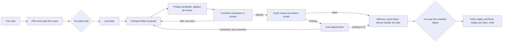

# Fusion CLI

**Let several AI coding models work on your repository — while Fusion, not the models, applies, verifies and delivers
every change, and nothing reaches your checkout until you approve its exact bytes.**


[](LICENSE)

> **Status: v0.4.0 — the reliability engine (evidence graph, proof obligations, isolated hypotheses, Fusion-owned checks,
> fresh falsification) on top of adaptive orchestration,
> [live-validated](docs/v0.4-reliability-engine.md#the-fourth-real-run-2026-09-28-pass--the-v040-acceptance) for the
> supported scope.** Models propose. Fusion verifies. Humans approve.
> Primary host: Windows 11. Writer verification runs in Docker (Linux containers). Models only ever *propose*; every change
> reaches your checkout through a delivery you explicitly approve. Unrestricted autonomous Writer mode — changes applied
> without that approval — is **not** enabled. See [How Fusion routes a task](#how-fusion-routes-a-task-v03).

## Just talk to it

```powershell
cd my-project
fusion
```

```text
Fusion · C:\homeassistant
Folder, not a Git repository · Home Assistant configuration · 13 files · 4 sensitive files kept private
Claude + Muse available
Read-only: this folder has no Git baseline, so Fusion will analyze it but not change it.
> Analyze this Home Assistant configuration
> Explain the first problem
> What would you change?
> Fix it
I can analyze this folder, but I won't change it yet because it has no Git safety baseline. Your files have not been modified.
```

Type what you want in plain words, in English or German: *analyze this project*, *are there problems in the automations?*,
*explain the first finding*, *what would you change?*, *fix the first one*, *history*, *help*. `exit`, `quit` or Ctrl+C
leave; Ctrl+C during a step cancels only that step.

- **Fusion decides what a line may do, not the model.** Each line is classified by Fusion itself (no model involved):
  talking, explaining, planning and analysing are read-only turns; only a change request can lead to a change, and only
  through the verified route below after you say yes. A read-only turn can never turn into a write.
- **Teamwork where it pays off.** A small question gets one model. A broad analysis of a large project, or the question
  whether a finding really holds, becomes an adaptive route. The Lead (Claude by default) decides whether to answer or to
  delegate bounded investigations. Explorers (Muse) run them in parallel, each in its own copy. The Lead reclaims the task
  with their reports, and the Reviewer (Muse) gives a fresh second opinion. Fusion's host policy authorizes every step and
  caps it with a budget (see [below](#how-fusion-routes-a-task-v03)).
- **Changing things in a Git repository:** *fix the first one* shows the build plan (task, exact files, verification) and
  asks `Start this verified build? [y/N]`. If the build prepares a delivery, you get one summary — files, verification
  result, review result, delivery id and manifest digest — and `Apply these exact verified changes? [y/N]`. Nothing is
  committed or pushed.
- **Refused:** requests to skip the safety steps (*just edit it directly without all that safety stuff*). Unbounded
  destructive requests (*delete everything*) are asked back.

### Folders without Git

Fusion analyzes any folder — a Home Assistant configuration, a scripts folder — read-only. It **never changes a folder
that is not a Git repository**: without a baseline it could neither prove what it changed nor give you a clean way back.
To let Fusion prepare changes, create the baseline yourself (back up the folder, add a `.gitignore` for `secrets.yaml`,
`.storage/` and other private files, then `git init`, `git add -A`, `git commit`). Fusion never creates, overwrites or
pushes a repository for you.

### Sensitive files

Before any model can read a project, Fusion copies it into a private, read-only view and applies its input policy:

- **Withheld** (never copied): private keys and certificates (`*.pem`, `*.key`, `id_rsa`, …), credential files
  (`credentials*`, `.git-credentials`, `.npmrc`, `.netrc`, service-account and token files, `secrets.json`), authentication
  stores such as Home Assistant's `.storage/`, `.ssh/`, `.aws/`, databases, binaries and files over 1 MiB.
- **Key names only**: `secrets.yaml` / `secret*.yml` and `.env` / `.env.*` — a model sees which secrets exist
  (`mqtt_password: <redacted>`), never their values.
- **Masked values** in every other text file: tokens and API keys, JWTs, bearer tokens, passwords in URLs, private-key
  blocks, and secret-named settings (`password: …` in configuration files).

**The same policy covers building.** When a conversation turns into a change ("fix it"), the Lead, the Change Author
and the Reviewer read the same filtered copies, and every review diff masks secret values. Two rules keep changes exact:

- A **protected file** (anything withheld or reduced to key names above) is never part of a build: if a fix would have to
  change one, Fusion stops before any model turn and tells you why — make that change yourself, or narrow the task.
- A **normal file with a secret value inside** (an inline password in `configuration.yaml`) stays editable. The Change
  Author sees `password: <redacted:password:1>` and keeps that marker; Fusion puts the exact value back on its own side
  before applying, verifying and delivering. A marker Fusion cannot restore exactly stops the build for your decision.

The delivery then holds the exact bytes to write (it has to, to apply them); it stays in your local application state and
never goes to a model.

The inventory reports which files were kept private; their contents are never read into a prompt. The shell remembers only
safe metadata per project (counts, the last delivery id) in Fusion's application-state directory — never a transcript,
finding or secret.

### How Fusion routes a task (v0.3)

Fusion does not pick one fixed pipeline when you ask something. It classifies your line itself (no model involved), then
decides each next step from what it observed:

- **A simple task stays simple.** *what does package.json do?*, *explain the first finding* or a narrow analysis is
  one lead turn: `Route: lead only`.
- **A large task is delegated.** *analyze the whole repository* on a large project starts with the Lead's routing
  decision: answer directly, or delegate up to three bounded investigations. Each investigation runs **in parallel**, in
  its own read-only copy of your project and a fresh provider session, with only its packet (area, question, earlier
  validated findings), never a transcript. The Lead then reclaims the task with the validated reports.
- **Weak evidence escalates, within budget.** Failed, inconclusive, conflicting or uncited reports are weak evidence. A
  transient failure is repeated once, and every failed attempt is shown with its category. The Lead may ask for one more
  bounded batch, synthesize with what is known, or stop without a conclusion. A single answer that runs out of steps
  escalates to delegation.
- **Is it really a bug?** *is the first finding really a problem?* or *is the trusted_proxies finding really a problem?*
  checks that one finding as a claim.
  - Fusion selects the finding by position or by its distinctive terms. If several findings match, or none, it asks
    rather than guessing.
  - The Lead answers directly, or investigations judge the claim (supported, contradicted, unclear). A disagreement is
    shown as a conflict, never merged into a fake consensus.
  - *fix it* then takes that finding, with the files its verification cited, into the same verified build route as
    before, and never the analysis's broad proposal.

Every analysis says what happened, without any model's reasoning:

```text
  Route: lead decision → 3 parallel investigations → lead synthesis → fresh review
  Turns: 6 model turns (lead 2 · explorers 3 · reviewer 1) · 1 batch (1 parallel) · 41 s
```

**A model only proposes the next step; Fusion authorizes it.** A routing decision is one strict JSON object, read against
the actions, areas and budget Fusion allows at that moment. A request for an unknown or withheld area (such as Home
Assistant's `.storage/`), for too many investigations, or with any extra field is refused, and Fusion falls back to its
own bounded choice and says so. Host-enforced budgets cap concurrent investigations, batches, repeats and model turns
per role and in total, and time. When a budget runs out, the route stops and says the evidence is incomplete. No model
can raise its own budget, widen a view or start a change.

`history` in the shell also shows safe counts of this session's routes (turns per role, parallel batches, repeats,
escalations, budget stops). Nothing of a prompt or reply is stored.

### How Fusion decides what holds (v0.4)

A model's claim is never evidence on its own. Fusion keeps an evidence graph: what a model claimed, what Fusion itself
observed, and whether that supports or contradicts the claim.

- **"is it true that …?", "is that really a bug?", "why does … fail?"** start a claim check:
  - one evidence snapshot goes to two independent investigators, each in its own copy and session;
  - Fusion runs the exact-text checks they propose (or derives from your claim) on the shared copy itself;
  - a fresh falsifier tries to break the conclusion.

  The claim is SUPPORTED or CONTRADICTED only by Fusion's checks, and stays UNVERIFIED otherwise, however many models
  agree.
- **A build proves its proof obligations** — Fusion's checks on the unchanged baseline first (fail before, pass after),
  scope, protected files and, where the policy requires it, a fresh falsification. `Decision: VERIFIED` is the only
  decision a delivery is prepared for without a question. An UNVERIFIED or BLOCKED run is never delivered as a success.

Details: [v0.4 reliability engine](docs/v0.4-reliability-engine.md).

### In development: evidence-driven candidate selection (v0.5)

v0.5 is on `main`: it is not in the 0.4.0 package, and its live acceptance is pending. For a change with something to
compare — a fix at medium risk or above, security-sensitive work, competing explanations, or an earlier failed attempt —
`fusion build` can run 2 or 3 independent candidates. The plan says how many, and your confirmation covers that number.

- **One frozen profile.** Fusion holds every candidate to one verification profile, frozen before any result, and runs its
  own experiments: the configured probes, property and fuzz runs, and mutations of each candidate's change.
- **Selection by Fusion's evidence, or your choice in a tie.** Never a model's vote or a score.
- **Delivery.** The selected change is revalidated freshly and goes through the unchanged v0.4 delivery and your approval.
- **Budget.** `--candidates 1|2|3` sets the number yourself. `limits.maxCandidates` in `fusion.config.json` caps it for
  the repository; `limits.maxCandidates: 1` keeps every build on the v0.4 route.

Details: [v0.5 evidence-driven candidate selection](docs/v0.5-autonomous-engineering.md) ·
[v0.5 invariant matrix](docs/v0.5-invariant-matrix.md).

### What "analyzed" means (coverage)

After each analysis Fusion prints what it can vouch for: how many files it inventoried (and which folders it skipped),
how many it shared with the models as-is, masked or withheld, which areas it assigned to explorer investigations (and
whether each report came back), which shared files the final answer cites, and which areas were neither assigned nor
cited. A broad analysis also says who chose the areas: `Planning: Claude selected 2 investigation areas (…)`, or — when
the lead's structured plan is invalid or its planning turn fails — `Planning: Claude's structured plan was invalid
(unknown area); Fusion selected 3 bounded areas instead (…)`. Fusion cannot see which files a model actually opened, so
"assigned" and "cited" are all it claims; it never says the whole project was read.

## Why Fusion

Asking one model to plan, write, test, review and judge its own work makes that model the only authority on whether the
work is right. Fusion splits those jobs:

- **Models reason and propose.** A Lead plans, a Change Author proposes changes, a different model reviews them fresh.
  They run read-only, in copies of your repository.
- **Fusion owns everything that matters.** It validates each proposed change, applies it to a private candidate, runs
  your tests in a confined container, keeps the evidence, and packages the result as an immutable delivery.
- **You own the last step.** You confirm each build and approve each delivery; `fusion apply` then checks your checkout
  and writes exactly the approved bytes, once. Fusion never commits, pushes or merges.

## What it does

| | |
| --- | --- |
| **Just talk** | `fusion` — the conversational shell above (analysis, explanations, plans, verified changes). |
| **Talk and look** | `fusion chat` — a conversation about your repository. `fusion analyze` — Fusion's inventory plus a model analysis. Read-only. |
| **Build** | `fusion build "<task>"` — plan, confirm, then Lead → Change Author → verification → fresh review → delivery. |
| **Create** | `fusion create "<description>"` — a new Node.js + TypeScript project (library, CLI or API), then the same build. |
| **Deliver** | `fusion inspect-delivery`, `fusion approve-delivery`, `fusion apply` — see the diff, approve the digest, apply. |
| **Keep track** | `fusion history`, `fusion show` — what ran, what it left, the next step. `fusion config`, `fusion doctor` — setup. |

## Quick start

v0.4.0 is not published to a package registry; install it from source. You need Windows 11, Node.js 22 or newer, Git, and
for builds Docker Desktop (Linux containers) plus the provider CLIs (see [Supported scope](#supported-scope)).

```powershell
git clone https://github.com/Tanerinki/fusion-cli.git
cd fusion-cli
npm ci
npm pack                                     # builds the CLI and writes fusion-cli-0.4.0.tgz
npm install --global .\fusion-cli-0.4.0.tgz
fusion --version                             # fusion 0.4.0
```

Or run it without installing: `npm run build`, then `node dist/src/cli/main.js` (the shell) or `node dist/src/cli/main.js <command>`.

Before the first build, pull the pinned verification image once (Fusion never pulls images itself) and check your setup:

```powershell
docker pull node@sha256:b21fe589dfbe5cc39365d0544b9be3f1f33f55f3c86c87a76ff65a02f8f5848e
fusion doctor        # runtime, repository, provider CLIs, readiness
fusion config        # roles and models in effect, verifier profile, where state lives
```

## Examples

```powershell
# Talk about the repository you are in (REPL; /help lists commands) — or ask once
fusion chat
fusion chat -- "Where is authentication handled?"

# Inventory plus one model analysis; --inventory-only runs no model at all
fusion analyze --focus tests

# Build: Fusion shows the plan and the exact files, and starts only when you type "build"
fusion build -- "Fix the rounding in src/price.ts and add a regression test."
fusion build --path src/price.ts --path test/price.test.ts -- "Fix the rounding and add a regression test."

# Deliver the result: read the diff, approve by typing the manifest digest, apply
fusion inspect-delivery d-0123456789abcdef01234567
fusion approve-delivery d-0123456789abcdef01234567
fusion apply d-0123456789abcdef01234567

# Start a new project: a template and a Git baseline in a new directory, then the confirmed build
fusion create --template cli --name renamer -- "a command-line tool that renames photos by their date"

# What happened, and what to do next
fusion history
```

A repository needs a confined verification plan in `fusion.config.json` before it can be built (projects made by
`fusion create` get one):

<details>
<summary>Example <code>fusion.config.json</code></summary>

```json
{
  "schemaVersion": 1,
  "verification": {
    "commands": [],
    "platformRequirement": "linux-compatible",
    "dependencies": "none",
    "confinedCommands": [
      { "id": "unit", "executable": "/usr/local/bin/node", "args": ["--test", "test/**/*.test.ts"], "cwd": ".",
        "timeoutMs": 180000, "mutationPolicy": "readOnly" }
    ]
  }
}
```

With a configuration file, its `bindings` replace the built-in role defaults — copy them from a project `fusion create`
made, or omit the file to use the defaults for `chat` and `analyze`. `conversation.partner` sets the default chat partner.
The file must never hold secrets; credential-like keys are refused.
</details>

## How a build works



- Every model session runs **read-only** in a Fusion-owned copy of the repository; the Change Author's output is a
  proposal (a validated change set), never a write.
- A run has at most one verification retry and one review-driven correction; beyond that it stops for your decision.
  If the Lead needs a decision, the run stops before any change and shows its questions.
- The roles are configuration. The current, live-validated defaults bind the **Lead** and the **Change Author** to the
  Claude Code CLI and the **Reviewer** to the Muse CLI; `fusion config` shows what is in effect.

More: [architecture overview](docs/architecture-overview.md).

## Safety model

- **Models are untrusted proposal engines.** Their text is data; their structured replies are validated strictly, and
  malformed output fails closed.
- **Fusion owns mutation.** Only Fusion applies a change set, only to private candidates, and only within the exact file
  scope you confirmed.
- **Verification is Fusion's, not the model's.** Your commands run in a Docker container without network, as an
  unprivileged user, on a read-only root filesystem. A build that cannot be verified this way is refused before any model
  turn.
- **Review is fresh.** The Reviewer sees the change and Fusion's evidence, never the Change Author's transcript or
  reasoning. Findings are adjudicated by the Lead; retries and corrections are bounded.
- **Deliveries are immutable and bound.** A delivery is a manifest plus the exact bytes, stored outside the repository and
  bound to the repository, the checkout and the baseline commit.
- **You approve, once.** Approval means typing the full manifest digest at an interactive terminal (`fusion
  approve-delivery`) or, in the shell, answering an explicit yes under the summary of that exact delivery; both approvals
  are bound to the same manifest, bundle, repository, checkout and baseline, and are recorded as what they were. `fusion apply`
  prechecks the checkout (clean tree, expected HEAD, every file as expected) before writing anything, then takes a
  single-use claim; a failure rolls the files back. There is no `--force`, `--yes` or setting that skips any of this.
- **Secrets stay out of prompts.** Credentials and authentication stores are withheld from every conversation view and
  secret values are masked (see [Sensitive files](#sensitive-files)).
- **Evidence stays clean.** Run records hold bounded, redacted metadata — never provider transcripts, hidden reasoning or
  credentials. Conversations are not recorded.
- **No automatic Git operations.** No commit, push, merge, tag or release.

Details: [security model](docs/security-model.md) · [SECURITY.md](SECURITY.md).

## Supported scope

| Area | v0.4 |
| --- | --- |
| Host | Windows 11 (validated). Other hosts are untested. |
| Runtime | Node.js ≥ 22, Git, npm |
| Providers (defaults) | Claude Code CLI (Lead, Change Author) and Muse CLI (Reviewer, Explorer), each logged in with a subscription; API-key and gateway credential sources are refused. Bindings are configurable per role. Claude Code: 2.1.280 is the recorded validated release; later 2.1.x patches are accepted after Fusion checks their read-only posture itself (see [Claude updates](#claude-updates)); other release lines are refused until Fusion supports them. Muse: the Reviewer binding is validated on exact releases and binaries (1.4.0-R4161.1 and 1.4.0-R4302.1, each by its SHA-256); any other release or binary is refused until validated. The dedicated Explorer binding is not validated, so the validated Reviewer binding runs investigations. |
| Verifier | Docker with Linux containers and the pinned `node:22.20.0-bookworm-slim` image (by digest) |
| Verification platforms | `linux-compatible`, `platform-neutral`; `windows-required` is refused before any model turn |
| Dependencies | `none`, or `npm-lockfile`: a restricted npm lane (registry-only, integrity-checked packages from the lockfile, no lifecycle scripts, installed in a separate preparation container). A change to a dependency manifest stops for a human decision. |
| Change size | The exact files confirmed before the run (the Lead proposes at most 24); a change set has at most 32 operations, 1 MiB per file, 4 MiB in total |
| `create` | Node.js 22.18+ with TypeScript (type stripping) and `node:test`; families `library`, `cli`, `api`; no dependencies. Other stacks are refused. |
| Runs | One verification retry and one review-driven correction per run |

## Claude updates

Claude Code updates itself often. Fusion does not trust a version number: before a new patch of the validated release
line (2.1.x after 2.1.280) serves its first turn, Fusion checks that runtime's read-only posture mechanically — init-only
startups in a Fusion-owned test folder whose project settings, local settings, MCP file, agents, skills, commands and
hooks would show up (or leave a marker file) if Claude's isolation flags did not hold. No model is called and nothing is
sent. Every turn then proves the rest again: exactly Read, Grep and Glob as tools, no MCP server, no plugin, no hook,
`dontAsk`, the configured model and a subscription login with no API key. `fusion doctor --probe` runs the same check on
demand and prints the result. If the check fails, or the runtime belongs to another release line, Fusion refuses in plain
words and sends nothing; a new release line needs a Fusion update. One property is not observable without a model turn:
whether CLAUDE.md reaches the model; on a checked patch it rests on `--safe-mode`, whose other effects the check proves.

## Expert commands

Everything the shell does is also available as a command, for scripts and for full control:

| Command | Purpose |
| --- | --- |
| `fusion` | The conversational shell (interactive terminal only; otherwise exit 2) |
| `fusion chat [--with <partner>] [-- "<message>"]` | Read-only conversation (REPL, or one message); works in folders without Git |
| `fusion analyze [<path>] [--deep] [--focus <topic>] [--inventory-only] [--with <partner>]` | Inventory plus one read-only model analysis; works in folders without Git |
| `fusion build [--path <p>]... [--operation <op>] [--timeout <s>] [--] "<task>"` | Confirmed, verified, reviewed build that prepares a delivery |
| `fusion create [--template library\|cli\|api] [--name <dir>] [--] "<description>"` | New project, then the confirmed build |
| `fusion inspect-delivery <id>` | Digests, target, diff, evidence, approval state |
| `fusion approve-delivery <id>` | Approve by typing the manifest digest (interactive only) |
| `fusion apply <id>` | Precheck, single-use claim, write; rollback on failure |
| `fusion history [--limit <n>]` | Recent runs, their deliveries, the next step |
| `fusion show <run-id>` | One run: outcome, model turns, delivery, next step |
| `fusion config` | Effective roles, models, verifier profile, state locations |
| `fusion doctor [--probe]` | Read-only diagnostics |
| `fusion review [--base <ref>] [--no-verify] [--timeout <s>]` | Fresh read-only review of your working tree |
| `fusion audit` | Deterministic audit of Fusion-relevant state |

Global options: `--json` (not for `create` and `approve-delivery`, which ask you), `--debug`, `--config <file>`,
`--cwd <dir>`. `fusion <command> --help` shows one command.

<details>
<summary>Troubleshooting and exit codes</summary>

| Symptom | What to do |
| --- | --- |
| `Build not started: Confined verification is not available …` | Start Docker (Linux containers) and pull the image above; `fusion doctor` shows the verifier. No model turn was spent. |
| `No confined verification plan is configured` | Add `verification.confinedCommands` and `platformRequirement` to `fusion.config.json`; `fusion config` shows the plan. |
| `Not inside a Git working tree` | `build`, `review`, deliveries and history need a Git repository (`fusion`, `chat` and `analyze` also work in a plain folder, read-only). |
| `No configured provider can hold a conversation` | `fusion doctor`: log in to the provider CLIs; check `fusion config`. |
| `The proposed scope …` refused | The Lead proposed a path Fusion does not allow; rerun with `--path` for each file. |
| `DECISION_REQUIRED` | The Lead asked for a decision (the output, `fusion show` and `fusion history` list its questions), or the run reached its bounds. Decide or refine, then build again with that in the task. |
| Apply: precheck failed | Your checkout changed (HEAD moved, files differ, untracked files). Fix it — the approval is kept — and apply again. |
| Apply: `approval was spent` | That delivery was applied, rolled back or interrupted after its claim; build again for a new delivery. |
| `WRITER_NOT_READY` in doctor | It concerns unattended Writer mode, which stays off; confirmed builds do not need it. |

Exit codes: 0 completed/answered/ready, 1 internal, 2 invalid input, 3 billing/auth, 4 security policy, 5 capability
unavailable, 6 provider failure, 7 timeout, 8 workspace conflict (including precheck failures and rollbacks), 9 verification
failed, 10 storage, 11 blocked, 12 review required, 13 decision required, 14 human gate required, 15 degraded (doctor), 130
cancelled.
</details>

## Live validation

On 2026-09-28 the maintainer ran the v0.4 live acceptance against the real provider CLIs on disposable targets. The fourth
run that day passed all five parts; the three before it had each found a defect, fixed before the next run.
- **L1:** a simple question stayed one lead turn.
- **L2:** a diagnosis: one snapshot, two isolated hypotheses, Fusion's checks and a fresh falsification.
- **L3:** your false claim ended CONTRADICTED by Fusion's own checks after two real investigator turns.
- **L4:** the fresh falsifier ran, its structured report was read, and its objection stayed open.
- **L5:** analysis → check → *fix it* → the build established 5 of 5 obligations itself (`Decision: VERIFIED`) → Docker
  verification → your approval → the checkout-bound apply, with only `configuration.yaml` changed and no sentinel seen.

Record: [docs/v0.4-reliability-engine.md](docs/v0.4-reliability-engine.md#acceptance).

On 2026-09-28 the maintainer ran the v0.3 live acceptance against the real provider CLIs on disposable targets, and all
four parts passed:
- **L1:** a simple question stayed one lead turn.
- **L2:** a broad analysis of a clone of this repository ran the lead's decision and three parallel investigations. One
  failed once and answered after its bounded repeat (3 of 3 answered). Then came the Claude synthesis and a fresh Muse
  review, and the clone was unchanged.
- **L3:** the verification of one finding.
- **L4:** on a Home Assistant Git fixture: analysis → *is the trusted_proxies finding really a problem?* → *fix it*. The
  task carried the verification's cited files (`configuration.yaml`, `home-assistant.log`), and the scope was
  `configuration.yaml`. Then Docker verification, your approval and the checkout-bound apply, with only that file changed,
  the secrets byte-identical and no sentinel seen.

Two earlier runs that day found two defects, each fixed before the passing run: the runner's verdict on a recovered
route, and the handoff of a verified finding to *fix it*. Record: [docs/v0.3-adaptive-orchestration.md](docs/v0.3-adaptive-orchestration.md#live-acceptance-maintainer-real-providers).

On 2026-09-27 the maintainer ran the v0.2 live validation against the real provider CLIs on disposable targets, and all
three parts passed: **A** — the shell in a Home Assistant folder without Git (analysis by the real Claude lead, secrets
withheld or masked, `fix it` blocked without a Git baseline, the bypass request refused, the folder unchanged); **B** — a
broad analysis of a large repository (the lead's structured plan, isolated Muse explorer investigations, the Claude
synthesis, a fresh Muse critique, a truthful coverage account, the clone unchanged); **C** — `fix the trusted_proxies
finding` in a Git repository through the lead's scope, a read-only proposal, the private candidate, confined Docker
verification, an immutable delivery, explicit approval and the checkout-bound apply, with the inline secret preserved and
only the intended file changed. Live C's change was LOW risk and ran no fresh review; that path's live evidence is the v0.1
acceptance below. Record: [docs/v0.2-live-validation.md](docs/v0.2-live-validation.md).

On 2026-09-26 a human ran the v0.1 live acceptance against the real provider CLIs, on disposable targets only, using 12 of
50 authorized model turns: `chat` and `analyze` left the repository unchanged; `build` and `create` each went through
confined Docker verification, a clean fresh review, a delivery approved by typing its manifest digest, and the production
`fusion apply` — with the target's tests passing afterwards (2/2 and 16/16). The acceptance also caught one defect (a Lead
decision request that was not shown), fixed before the final run. Record: [docs/v0.1-live-acceptance.md](docs/v0.1-live-acceptance.md).

## Limitations

- Validated live on Windows 11 with a small number of runs per scenario on disposable targets; broader behavior is covered
  by the deterministic offline suite.
- v0.4's and v0.3's live acceptances are one passing run per part. Broader adaptive-routing behaviour is covered offline, including
  real provider adapters on scripted fake binaries whose parallel processes are proven concurrent.
- Provider turns can fail. Fusion repeats a failed investigation once, then reports it with its category and marks the
  evidence incomplete. It makes no claim of error-free autonomy.
- Claim checks are narrow on purpose: Fusion's own checks test literal text in one shared file. Not every defect is
  reproducible with the configured checks; one that is not stays *not reproduced*, never assumed.
- Investigators and the falsifier may be the same validated Reviewer binding and model, in separate contexts; only
  Fusion's checks decide a status.
- On the current Muse runtime the dedicated Explorer binding's read-only posture is not proven. The validated Reviewer
  binding runs the investigations, each in its own context and copy, and the terminal says so.
- Finding selection is deterministic term matching; a reference Fusion cannot bind to exactly one finding is asked about.
- Provider processes run under your user account. A provider view is a Fusion-owned read-only copy whose changes Fusion
  detects; it is not an operating-system sandbox.
- Builds need Docker with Linux containers; projects that must be verified on Windows cannot be built.
- A build changes only the exact files confirmed before it starts; it cannot add files mid-run.
- `create` makes Node.js + TypeScript projects only, without dependencies.
- An apply rolls back file by file (journaled and verified), which is not a multi-file transaction; if the whole process
  dies mid-apply, the journal and backups stay in the repository's Git directory for manual recovery. An apply interrupted
  before its claim leaves that delivery locked — build again.
- Conversations are not saved; `fusion chat` and the shell start fresh each time (the shell keeps only safe metadata).
- The shell's intent routing is deterministic keyword matching (English and German); an unrecognised line is treated as a
  question. Coverage reports what was shared and cited, not what a model actually read.
- A build never changes a protected file (credentials, key material, `secrets.yaml`, `.env`, `.storage/`, binaries, files
  over 1 MiB); such changes are yours to make. Secret patterns are high-confidence shapes: an unusual secret format in an
  ordinary file may not be recognised.
- Not included: unattended Writer mode, network access for verification commands, automatic commits, pushes or merges,
  parallel autonomous writers or candidate tournaments. Not published to npm.

## Documentation

- [Architecture overview](docs/architecture-overview.md) · [Security model](docs/security-model.md) ·
  [Host-controlled changes](docs/host-controlled-changes.md)
- [v0.5 evidence-driven candidate selection](docs/v0.5-autonomous-engineering.md) (in development; live acceptance pending)
  · [v0.5 invariant matrix](docs/v0.5-invariant-matrix.md)
- [v0.4 reliability engine](docs/v0.4-reliability-engine.md) (with its live acceptance and invariant matrix) ·
  [v0.4.0 release notes](docs/release-v0.4.0.md) ·
  [v0.3 adaptive orchestration](docs/v0.3-adaptive-orchestration.md) (with its live acceptance) ·
  [v0.3.0 release notes](docs/release-v0.3.0.md) · [Muse R4302.1 Reviewer validation](docs/v0.3-muse-r4302-reviewer-validation.md) ·
  [v0.2 live validation](docs/v0.2-live-validation.md) · [v0.2.5 release notes](docs/release-v0.2.5.md) ·
  [v0.1 live acceptance](docs/v0.1-live-acceptance.md) · [v0.1.0 release notes](docs/release-v0.1.0.md) ·
  [Roadmap](ROADMAP.md) · [Changelog](CHANGELOG.md)
- The other files in [docs/](docs/) are the engineering record of the milestones that led to v0.1 (historical).

## Development

```powershell
npm ci
npm run typecheck
npm test               # build + the deterministic suite: no provider, network or Docker daemon
npm run smoke:pack     # clean clone → pack → install into a private prefix → run the installed CLI (never publishes)
```

Live tests are opt-in and never part of `npm test`. See [CONTRIBUTING.md](CONTRIBUTING.md).

## Security

Please do not report vulnerabilities in public issues; see [SECURITY.md](SECURITY.md).

## License

Fusion CLI is licensed under the [Apache License 2.0](LICENSE).

---

Fusion CLI is an independent project. Its provider integrations do not imply affiliation with or endorsement by any model
or platform vendor. "Claude" and "Muse" name the command-line tools Fusion drives; they belong to their respective owners.
