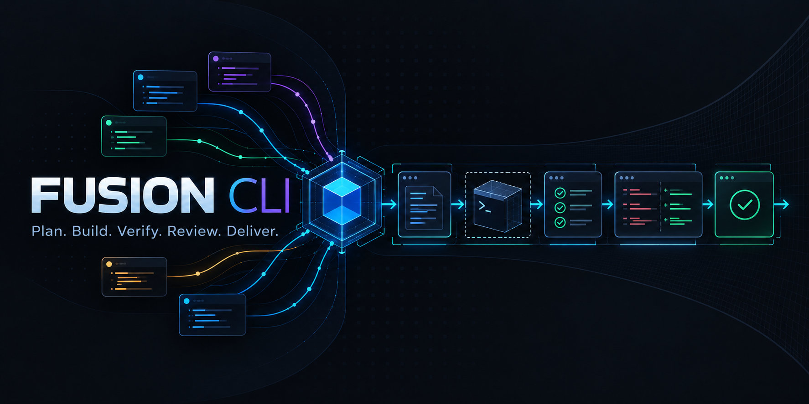
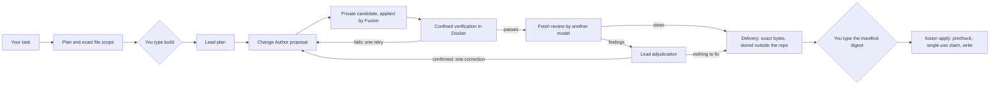

# Fusion CLI

**Let several AI coding models work on your repository — while Fusion, not the models, applies, verifies and delivers
every change, and nothing reaches your checkout until you approve its exact bytes.**


[](LICENSE)

> **Status: v0.1.0 — code complete and [live-validated](docs/v0.1-live-acceptance.md) for the supported scope.**
> Primary host: Windows 11. Writer verification runs in Docker (Linux containers). Models only ever *propose*; every change
> reaches your checkout through a delivery you approve by typing its digest. Unrestricted autonomous Writer mode — changes
> applied without that approval — is **not** enabled.
>
> **Unreleased (on `main`): the v0.2 conversational shell** — run `fusion` in any project folder and talk to it. It is not
> part of the v0.1.0 release and has not been live-validated yet.

## Just talk to it

```powershell
cd my-project
fusion
```

```text
Fusion · C:\homeassistant
Folder, not a Git repository · Home Assistant configuration · 13 files · 4 sensitive files kept private
Claude + Muse available
Read-only: this folder has no Git baseline, so Fusion will analyze it but not change it.
> Analyze this Home Assistant configuration
> Explain the first problem
> What would you change?
> Fix it
I can analyze this folder, but I won't change it yet because it has no Git safety baseline. Your files have not been modified.
```

Type what you want in plain words, in English or German: *analyze this project*, *are there problems in the automations?*,
*explain the first finding*, *what would you change?*, *fix the first one*, *history*, *help*. `exit`, `quit` or Ctrl+C
leave; Ctrl+C during a step cancels only that step.

- **Fusion decides what a line may do, not the model.** Each line is classified by Fusion itself (no model involved):
  talking, explaining, planning and analysing are read-only turns; only a change request can lead to a change, and only
  through the verified route below after you say yes. A read-only turn can never turn into a write.
- **Teamwork where it pays off.** A small question gets one model. A broad analysis of a large project is split: the Lead
  (Claude by default) plans up to three area packets, the Explorer (Muse) examines each one in isolation, the Lead writes
  the synthesis, and the Reviewer (Muse) gives a fresh second opinion on that synthesis only.
- **Changing things in a Git repository:** *fix the first one* shows the build plan (task, exact files, verification) and
  asks `Start this verified build? [y/N]`. If the build prepares a delivery, you get one summary — files, verification
  result, review result, delivery id and manifest digest — and `Apply these exact verified changes? [y/N]`. Nothing is
  committed or pushed.
- **Refused:** requests to skip the safety steps (*just edit it directly without all that safety stuff*). Unbounded
  destructive requests (*delete everything*) are asked back.

### Folders without Git

Fusion analyzes any folder — a Home Assistant configuration, a scripts folder — read-only. It **never changes a folder
that is not a Git repository**: without a baseline it could neither prove what it changed nor give you a clean way back.
To let Fusion prepare changes, create the baseline yourself (back up the folder, add a `.gitignore` for `secrets.yaml`,
`.storage/` and other private files, then `git init`, `git add -A`, `git commit`). Fusion never creates, overwrites or
pushes a repository for you.

### Sensitive files

Before any model can read a project, Fusion copies it into a private, read-only view and applies its input policy:

- **Withheld** (never copied): private keys and certificates (`*.pem`, `*.key`, `id_rsa`, …), credential files
  (`credentials*`, `.git-credentials`, `.npmrc`, `.netrc`, service-account and token files, `secrets.json`), authentication
  stores such as Home Assistant's `.storage/`, `.ssh/`, `.aws/`, databases, binaries and files over 1 MiB.
- **Key names only**: `secrets.yaml` / `secret*.yml` and `.env` / `.env.*` — a model sees which secrets exist
  (`mqtt_password: <redacted>`), never their values.
- **Masked values** in every other text file: tokens and API keys, JWTs, bearer tokens, passwords in URLs, private-key
  blocks, and secret-named settings (`password: …` in configuration files).

The inventory reports which files were kept private; their contents are never read into a prompt. The shell remembers only
safe metadata per project (counts, the last delivery id) in Fusion's application-state directory — never a transcript,
finding or secret.

### What "analyzed" means (coverage)

After each analysis Fusion prints what it can vouch for: how many files it inventoried (and which folders it skipped),
how many it shared with the models as-is, masked or withheld, which areas explorers examined in depth, which shared files
the answer cites, and which areas no answer covered. Fusion cannot see which files a model actually opened, so it never
claims the whole project was read.

## Why Fusion

Asking one model to plan, write, test, review and judge its own work makes that model the only authority on whether the
work is right. Fusion splits those jobs:

- **Models reason and propose.** A Lead plans, a Change Author proposes changes, a different model reviews them fresh.
  They run read-only, in copies of your repository.
- **Fusion owns everything that matters.** It validates each proposed change, applies it to a private candidate, runs
  your tests in a confined container, keeps the evidence, and packages the result as an immutable delivery.
- **You own the last step.** You confirm each build and approve each delivery; `fusion apply` then checks your checkout
  and writes exactly the approved bytes, once. Fusion never commits, pushes or merges.

## What it does

| | |
| --- | --- |
| **Just talk** | `fusion` — the conversational shell above (analysis, explanations, plans, verified changes). |
| **Talk and look** | `fusion chat` — a conversation about your repository. `fusion analyze` — Fusion's inventory plus a model analysis. Read-only. |
| **Build** | `fusion build "<task>"` — plan, confirm, then Lead → Change Author → verification → fresh review → delivery. |
| **Create** | `fusion create "<description>"` — a new Node.js + TypeScript project (library, CLI or API), then the same build. |
| **Deliver** | `fusion inspect-delivery`, `fusion approve-delivery`, `fusion apply` — see the diff, approve the digest, apply. |
| **Keep track** | `fusion history`, `fusion show` — what ran, what it left, the next step. `fusion config`, `fusion doctor` — setup. |

## Quick start

v0.1.0 is not published to a package registry; install it from source. You need Windows 11, Node.js 22 or newer, Git, and
for builds Docker Desktop (Linux containers) plus the provider CLIs (see [Supported v0.1 scope](#supported-v01-scope)).

```powershell
git clone https://github.com/Tanerinki/fusion-cli.git
cd fusion-cli
npm ci
npm pack                                     # builds the CLI and writes fusion-cli-0.1.0.tgz
npm install --global .\fusion-cli-0.1.0.tgz
fusion --version                             # fusion 0.1.0
```

Or run it without installing: `npm run build`, then `node dist/src/cli/main.js` (the shell) or `node dist/src/cli/main.js <command>`.

Before the first build, pull the pinned verification image once (Fusion never pulls images itself) and check your setup:

```powershell
docker pull node@sha256:b21fe589dfbe5cc39365d0544b9be3f1f33f55f3c86c87a76ff65a02f8f5848e
fusion doctor        # runtime, repository, provider CLIs, readiness
fusion config        # roles and models in effect, verifier profile, where state lives
```

## Examples

```powershell
# Talk about the repository you are in (REPL; /help lists commands) — or ask once
fusion chat
fusion chat -- "Where is authentication handled?"

# Inventory plus one model analysis; --inventory-only runs no model at all
fusion analyze --focus tests

# Build: Fusion shows the plan and the exact files, and starts only when you type "build"
fusion build -- "Fix the rounding in src/price.ts and add a regression test."
fusion build --path src/price.ts --path test/price.test.ts -- "Fix the rounding and add a regression test."

# Deliver the result: read the diff, approve by typing the manifest digest, apply
fusion inspect-delivery d-0123456789abcdef01234567
fusion approve-delivery d-0123456789abcdef01234567
fusion apply d-0123456789abcdef01234567

# Start a new project: a template and a Git baseline in a new directory, then the confirmed build
fusion create --template cli --name renamer -- "a command-line tool that renames photos by their date"

# What happened, and what to do next
fusion history
```

A repository needs a confined verification plan in `fusion.config.json` before it can be built (projects made by
`fusion create` get one):

<details>
<summary>Example <code>fusion.config.json</code></summary>

```json
{
  "schemaVersion": 1,
  "verification": {
    "commands": [],
    "platformRequirement": "linux-compatible",
    "dependencies": "none",
    "confinedCommands": [
      { "id": "unit", "executable": "/usr/local/bin/node", "args": ["--test", "test/**/*.test.ts"], "cwd": ".",
        "timeoutMs": 180000, "mutationPolicy": "readOnly" }
    ]
  }
}
```

With a configuration file, its `bindings` replace the built-in role defaults — copy them from a project `fusion create`
made, or omit the file to use the defaults for `chat` and `analyze`. `conversation.partner` sets the default chat partner.
The file must never hold secrets; credential-like keys are refused.
</details>

## How a build works



- Every model session runs **read-only** in a Fusion-owned copy of the repository; the Change Author's output is a
  proposal (a validated change set), never a write.
- A run has at most one verification retry and one review-driven correction; beyond that it stops for your decision.
  If the Lead needs a decision, the run stops before any change and shows its questions.
- The roles are configuration. The current, live-validated defaults bind the **Lead** and the **Change Author** to the
  Claude Code CLI and the **Reviewer** to the Muse CLI; `fusion config` shows what is in effect.

More: [architecture overview](docs/architecture-overview.md).

## Safety model

- **Models are untrusted proposal engines.** Their text is data; their structured replies are validated strictly, and
  malformed output fails closed.
- **Fusion owns mutation.** Only Fusion applies a change set, only to private candidates, and only within the exact file
  scope you confirmed.
- **Verification is Fusion's, not the model's.** Your commands run in a Docker container without network, as an
  unprivileged user, on a read-only root filesystem. A build that cannot be verified this way is refused before any model
  turn.
- **Review is fresh.** The Reviewer sees the change and Fusion's evidence, never the Change Author's transcript or
  reasoning. Findings are adjudicated by the Lead; retries and corrections are bounded.
- **Deliveries are immutable and bound.** A delivery is a manifest plus the exact bytes, stored outside the repository and
  bound to the repository, the checkout and the baseline commit.
- **You approve, once.** Approval means typing the full manifest digest at an interactive terminal (`fusion
  approve-delivery`) or, in the shell, answering an explicit yes under the summary of that exact delivery; both approvals
  are bound to the same manifest, bundle, repository, checkout and baseline, and are recorded as what they were. `fusion apply`
  prechecks the checkout (clean tree, expected HEAD, every file as expected) before writing anything, then takes a
  single-use claim; a failure rolls the files back. There is no `--force`, `--yes` or setting that skips any of this.
- **Secrets stay out of prompts.** Credentials and authentication stores are withheld from every conversation view and
  secret values are masked (see [Sensitive files](#sensitive-files)).
- **Evidence stays clean.** Run records hold bounded, redacted metadata — never provider transcripts, hidden reasoning or
  credentials. Conversations are not recorded.
- **No automatic Git operations.** No commit, push, merge, tag or release.

Details: [security model](docs/security-model.md) · [SECURITY.md](SECURITY.md).

## Supported v0.1 scope

| Area | v0.1 |
| --- | --- |
| Host | Windows 11 (validated). Other hosts are untested. |
| Runtime | Node.js ≥ 22, Git, npm |
| Providers (defaults) | Claude Code CLI (Lead, Change Author) and Muse CLI (Reviewer, Explorer), each logged in with a subscription; API-key and gateway credential sources are refused. Bindings are configurable per role. |
| Verifier | Docker with Linux containers and the pinned `node:22.20.0-bookworm-slim` image (by digest) |
| Verification platforms | `linux-compatible`, `platform-neutral`; `windows-required` is refused before any model turn |
| Dependencies | `none`, or `npm-lockfile`: a restricted npm lane (registry-only, integrity-checked packages from the lockfile, no lifecycle scripts, installed in a separate preparation container). A change to a dependency manifest stops for a human decision. |
| Change size | The exact files confirmed before the run (the Lead proposes at most 24); a change set has at most 32 operations, 1 MiB per file, 4 MiB in total |
| `create` | Node.js 22.18+ with TypeScript (type stripping) and `node:test`; families `library`, `cli`, `api`; no dependencies. Other stacks are refused. |
| Runs | One verification retry and one review-driven correction per run |

## Expert commands

Everything the shell does is also available as a command, for scripts and for full control:

| Command | Purpose |
| --- | --- |
| `fusion` | The conversational shell (interactive terminal only; otherwise exit 2) |
| `fusion chat [--with <partner>] [-- "<message>"]` | Read-only conversation (REPL, or one message); works in folders without Git |
| `fusion analyze [<path>] [--deep] [--focus <topic>] [--inventory-only] [--with <partner>]` | Inventory plus one read-only model analysis; works in folders without Git |
| `fusion build [--path <p>]... [--operation <op>] [--timeout <s>] [--] "<task>"` | Confirmed, verified, reviewed build that prepares a delivery |
| `fusion create [--template library\|cli\|api] [--name <dir>] [--] "<description>"` | New project, then the confirmed build |
| `fusion inspect-delivery <id>` | Digests, target, diff, evidence, approval state |
| `fusion approve-delivery <id>` | Approve by typing the manifest digest (interactive only) |
| `fusion apply <id>` | Precheck, single-use claim, write; rollback on failure |
| `fusion history [--limit <n>]` | Recent runs, their deliveries, the next step |
| `fusion show <run-id>` | One run: outcome, model turns, delivery, next step |
| `fusion config` | Effective roles, models, verifier profile, state locations |
| `fusion doctor [--probe]` | Read-only diagnostics |
| `fusion review [--base <ref>] [--no-verify] [--timeout <s>]` | Fresh read-only review of your working tree |
| `fusion audit` | Deterministic audit of Fusion-relevant state |

Global options: `--json` (not for `create` and `approve-delivery`, which ask you), `--debug`, `--config <file>`,
`--cwd <dir>`. `fusion <command> --help` shows one command.

<details>
<summary>Troubleshooting and exit codes</summary>

| Symptom | What to do |
| --- | --- |
| `Build not started: Confined verification is not available …` | Start Docker (Linux containers) and pull the image above; `fusion doctor` shows the verifier. No model turn was spent. |
| `No confined verification plan is configured` | Add `verification.confinedCommands` and `platformRequirement` to `fusion.config.json`; `fusion config` shows the plan. |
| `Not inside a Git working tree` | `build`, `review`, deliveries and history need a Git repository (`fusion`, `chat` and `analyze` also work in a plain folder, read-only). |
| `No configured provider can hold a conversation` | `fusion doctor`: log in to the provider CLIs; check `fusion config`. |
| `The proposed scope …` refused | The Lead proposed a path Fusion does not allow; rerun with `--path` for each file. |
| `DECISION_REQUIRED` | The Lead asked for a decision (the output, `fusion show` and `fusion history` list its questions), or the run reached its bounds. Decide or refine, then build again with that in the task. |
| Apply: precheck failed | Your checkout changed (HEAD moved, files differ, untracked files). Fix it — the approval is kept — and apply again. |
| Apply: `approval was spent` | That delivery was applied, rolled back or interrupted after its claim; build again for a new delivery. |
| `WRITER_NOT_READY` in doctor | It concerns unattended Writer mode, which stays off; confirmed builds do not need it. |

Exit codes: 0 completed/answered/ready, 1 internal, 2 invalid input, 3 billing/auth, 4 security policy, 5 capability
unavailable, 6 provider failure, 7 timeout, 8 workspace conflict (including precheck failures and rollbacks), 9 verification
failed, 10 storage, 11 blocked, 12 review required, 13 decision required, 14 human gate required, 15 degraded (doctor), 130
cancelled.
</details>

## Live validation

On 2026-09-26 a human ran the v0.1 live acceptance against the real provider CLIs, on disposable targets only, using 12 of
50 authorized model turns: `chat` and `analyze` left the repository unchanged; `build` and `create` each went through
confined Docker verification, a clean fresh review, a delivery approved by typing its manifest digest, and the production
`fusion apply` — with the target's tests passing afterwards (2/2 and 16/16). The acceptance also caught one defect (a Lead
decision request that was not shown), fixed before the final run. Record: [docs/v0.1-live-acceptance.md](docs/v0.1-live-acceptance.md).

## Limitations

- Validated live on Windows 11 with one run per command on small disposable targets; broader behavior is covered by the
  deterministic offline suite.
- Builds need Docker with Linux containers; projects that must be verified on Windows cannot be built.
- A build changes only the exact files confirmed before it starts; it cannot add files mid-run.
- `create` makes Node.js + TypeScript projects only, without dependencies.
- An apply rolls back file by file (journaled and verified), which is not a multi-file transaction; if the whole process
  dies mid-apply, the journal and backups stay in the repository's Git directory for manual recovery. An apply interrupted
  before its claim leaves that delivery locked — build again.
- Conversations are not saved; `fusion chat` and the shell start fresh each time (the shell keeps only safe metadata).
- The shell's intent routing is deterministic keyword matching (English and German); an unrecognised line is treated as a
  question. Coverage reports what was shared and cited, not what a model actually read.
- The sensitive-input policy applies to conversation and analysis views. Build views (the Change Author's) keep their
  v0.1 behavior: ignored files are never copied, but tracked secret files are not masked, so a change to them stays exact.
- Not in v0.1: unattended Writer mode, network access for verification commands, automatic commits.

## Documentation

- [Architecture overview](docs/architecture-overview.md) · [Security model](docs/security-model.md) ·
  [Host-controlled changes](docs/host-controlled-changes.md)
- [v0.1 live acceptance](docs/v0.1-live-acceptance.md) · [v0.1.0 release notes](docs/release-v0.1.0.md) ·
  [Roadmap](ROADMAP.md) · [Changelog](CHANGELOG.md)
- The other files in [docs/](docs/) are the engineering record of the milestones that led to v0.1 (historical).

## Development

```powershell
npm ci
npm run typecheck
npm test               # build + the deterministic suite: no provider, network or Docker daemon
npm run smoke:pack     # clean clone → pack → install into a private prefix → run the installed CLI (never publishes)
```

Live tests are opt-in and never part of `npm test`. See [CONTRIBUTING.md](CONTRIBUTING.md).

## Security

Please do not report vulnerabilities in public issues; see [SECURITY.md](SECURITY.md).

## License

Fusion CLI is licensed under the [Apache License 2.0](LICENSE).

---

Fusion CLI is an independent project. Its provider integrations do not imply affiliation with or endorsement by any model
or platform vendor. "Claude" and "Muse" name the command-line tools Fusion drives; they belong to their respective owners.
