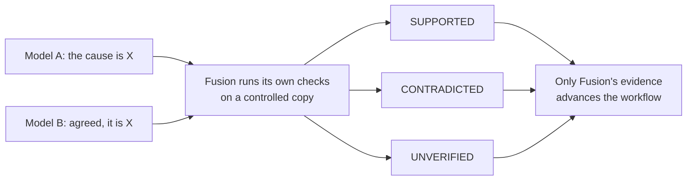
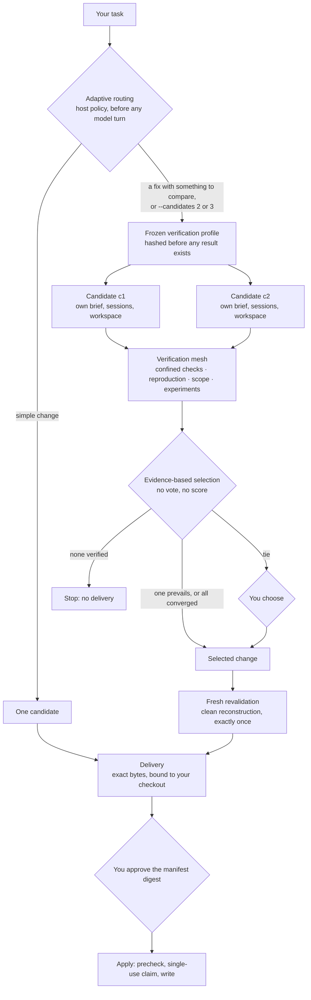

# Fusion CLI

**A local control and verification plane for AI coding agents.**

> **Models propose. Fusion verifies. Humans approve.**

AI models investigate, propose and review changes to your repository. Fusion — not the models — owns the evidence, the
verification, the choice between candidate solutions, the delivery and the application of every change. Nothing reaches
your checkout until you approve its exact bytes.

[](https://github.com/Tanerinki/fusion-cli/actions/workflows/ci.yml)
[](https://github.com/Tanerinki/fusion-cli/releases/latest)


[](LICENSE)

**v0.5.0 — the autonomous engineering engine.**
- **What it adds:** candidate tournaments, a frozen verification profile, Fusion-owned experiments, evidence-based
  selection and fresh revalidation, on top of the v0.4 reliability engine.
- **Validated:** live-validated for the [supported scope](docs/user-guide.md#supported-scope) (Windows 11, Docker with
  Linux containers).
- **Installation:** from source; not published to npm.

---

## The problem

AI coding agents can be confidently wrong. "I found the cause", "the tests pass" and "this is the best fix" are
statements, not evidence, and two models agreeing does not make a claim true.

Fusion treats every model statement as a proposal. Only what Fusion itself observes — its own checks, run on a
controlled copy of your repository — can move the work forward:



This does not make a model right. It makes a wrong model visible before anything reaches your checkout.

## How Fusion works

A change request goes through one host-owned pipeline. For a fix with something to compare, or when you ask for it,
Fusion runs several independent candidates and chooses between them by evidence. **No model selects the winner.**



Every model session runs **read-only** in a Fusion-owned copy of your repository. A model's change is a proposal (a
validated change set), which Fusion alone applies to a private candidate. Verification runs in a Docker container
without network access.

## Core mechanisms

| Mechanism | What it does |
| --- | --- |
| **Evidence graph** | Records what Fusion actually observed, per claim, with each piece's source and authority. A model statement is never evidence. |
| **Proof obligations** | What must hold before a change is VERIFIED: its checks pass, the scope and protected files are respected, a reproduced defect is resolved, a required falsification ends clean. |
| **Falsifier** | A fresh, read-only context that tries to break a conclusion. Its counterexamples stay open challenges; its checks run under Fusion. |
| **Candidate tournaments** | 2–3 independent implementations of one frozen task. Each has its own strategy brief, sessions and private workspace, and none sees another. |
| **Frozen verification profile** | The common mandatory checks, fixed and hashed before any candidate result exists. A candidate can only add checks, never remove one. |
| **Verification mesh** | Every proof channel for a candidate — configured checks, baseline reproduction, scope and protected-file checks, experiments — bound to that candidate's exact revision. |
| **Discriminating experiments** | Fusion-run, bounded observations that tell plausible candidates apart: preservation and output probes, property and fuzz runs of your own harness, and mutations of a candidate's own change. |
| **Evidence-based selection** | Candidates are eliminated by failed obligations or contradicting experiments. Survivors are compared on host-observed dimensions only. No voting, no confidence percentage. |
| **CONVERGED** | Candidates that produce the identical change are one result, not a contest. One represents it; none "beats" the other. |
| **MULTIPLE_VERIFIED_CANDIDATES** | Distinct candidates that Fusion's evidence does not separate. Fusion invents no winner: the decision is yours. |
| **Fresh revalidation** | The selected change is rebuilt in a clean candidate from the committed baseline and verified again, exactly once, before any delivery. |
| **Human approval** | A delivery never applies itself. You approve its exact manifest; `apply` writes only those bytes. |

## Verdicts

Fusion keeps two questions apart: **is a claim true?** and **may this change be delivered?**

| Claim status | Meaning |
| --- | --- |
| **SUPPORTED** | Fusion's own checks support the claim. |
| **CONTRADICTED** | Fusion's own checks contradict it. One fresh contradiction is enough, however many models agree. |
| **UNVERIFIED** | The available evidence does not settle it. |
| **STALE** | The evidence came from a checkout that has since changed. |

| Build decision / outcome | Meaning |
| --- | --- |
| **VERIFIED** | Every proof obligation holds on Fusion's evidence. A delivery can be prepared for your approval. |
| **UNVERIFIED** | An obligation could not be established. Never presented as a success; where the policy permits a delivery at all, its open obligations are shown before you decide. |
| **BLOCKED** | A safety obligation failed, such as a failing check or a protected file. Nothing is delivered. |
| **DELIVERY_ELIGIBLE** | A tournament selected a change (or its candidates converged), and it passed its fresh revalidation. |
| **DECISION_REQUIRED** | A tie (`MULTIPLE_VERIFIED_CANDIDATES`), no verified candidate (`NO_VERIFIED_CANDIDATE`), a failed revalidation (`REVALIDATION_MISMATCH`) or a model's question: a decision for you, with nothing applied. |

A conversational diagnosis can stay UNVERIFIED while the concrete fix still becomes VERIFIED. The build reproduces the
defect itself (a check fails on the unchanged baseline and passes after the change), and host-owned checks establish the
rest. The patch needs no model to have been right about *why*.

## Example: telling two plausible candidates apart

You ask for a fix. Two candidates propose different changes, and **both pass the ordinary tests**.

1. A repository-configured preservation probe runs on the unchanged baseline and on both candidates.
2. Candidate B's output differs from the baseline outside the fix: a behavioural regression. Fusion rejects B on that
   observation.
3. Candidate A is reconstructed from the baseline and verified again.
4. Only then is A eligible for delivery, and it still waits for your approval.

No model said which candidate was better; an observation did. Had both candidates made the identical change, Fusion
would report them as CONVERGED. Had they differed without any observation separating them, it would report a tie and ask
you.

## What's new in v0.5

| | |
| --- | --- |
| **Candidate tournaments** | Adaptive routing: simple work stays one candidate. A fix or refactor with something to compare runs 2 candidates by default (hard maximum 3). Something to compare means medium risk or above, security-sensitive, competing explanations, or an earlier failed attempt. A plain feature change stays single unless you ask. |
| **Explicit count authorization** | `fusion build --candidates 1\|2\|3` sets the count yourself; the plan shows it and your confirmation binds it. `limits.maxCandidates` caps it per repository. No model can raise it. |
| **Isolation** | Each candidate is a separate context with its own private workspace and Fusion-owned views; candidates never see each other. |
| **Frozen profile + mesh** | One verification profile, hashed before any result. Every proof channel is bound to the candidate's exact revision. |
| **Experiments** | Preservation, output and compare probes; bounded property and fuzz runs with deterministic seeds; bounded mutations of each candidate's own change. |
| **Selection semantics** | Evidence-based elimination and dominance. CONVERGED when the changes are identical, a tie when they differ and nothing separates them. |
| **Fresh revalidation + exact binding** | The selected change is reconstructed and re-verified. The delivery must be exactly that candidate's tree. |
| **Offline routing calibration** | Every build records its route decision as labels and counts only. An offline, read-only script compares versioned routing policies against past runs. Nothing learns online. |

Full detail: [v0.5.0 release notes](docs/release-v0.5.0.md) ·
[design](docs/v0.5-autonomous-engineering.md) · [invariant matrix](docs/v0.5-invariant-matrix.md).

## Trust boundary

| Models may | Fusion owns | You own |
| --- | --- | --- |
| investigate a repository (read-only copies) | every mutation, into private candidates only | confirming a build and its candidate count |
| reason and explain | verification, in confinement | approving a delivery's exact manifest |
| propose changes, as validated change sets | evidence, and every claim's status | choosing between tied candidates |
| propose checks, which Fusion runs | the candidate lifecycle and selection | answering a model's genuine question |
| review, and try to falsify | delivery, approval binding and apply | |

Being a candidate grants a model no authority. It cannot:
- modify your checkout;
- change its own count;
- weaken the verification profile;
- waive a failed obligation;
- select itself;
- judge another candidate;
- approve a delivery.

## Safety model

- **Your checkout is protected until an explicit apply.** Models work in Fusion-owned, read-only copies. Candidates are
  private workspaces, and a tournament proves your checkout unchanged before, during and after it.
- **Strict inputs.** Structured model replies are validated strictly; malformed or unstructured output is refused and
  never becomes evidence.
- **Protected material stays out.**
  - Credentials, key material and authentication stores are withheld from every model.
  - Secret values are masked in every view.
  - A change to a protected file is never delivered.
- **Everything is bound.** Evidence is bound to a candidate's exact revision; a delivery to the exact change, the
  checkout and the baseline commit; your approval to that exact manifest.
- **Bounded and fail-closed.** Retries, corrections, candidates, experiments and time are capped by the host. A provider
  failure, a timeout or a failed revalidation ends in a named state, never an optimistic success.
- **No Git side effects.** Fusion never commits, pushes, merges, tags or releases, and nothing skips your approval.

Details: [security model](docs/security-model.md) · [SECURITY.md](SECURITY.md) ·
[architecture overview](docs/architecture-overview.md).

## Quick start

You need Windows 11, Node.js 22 or newer and Git. Builds also need Docker Desktop (Linux containers) and the provider CLIs
(Claude Code and Muse by default, each with a subscription login). See the [user guide](docs/user-guide.md#supported-scope).

```powershell
git clone https://github.com/Tanerinki/fusion-cli.git
cd fusion-cli
npm ci
npm pack                                     # builds the CLI and writes fusion-cli-0.5.0.tgz
npm install --global .\fusion-cli-0.5.0.tgz
fusion --version                             # fusion 0.5.0

# Once, before the first build: the pinned verification image (Fusion never pulls images itself)
docker pull node@sha256:b21fe589dfbe5cc39365d0544b9be3f1f33f55f3c86c87a76ff65a02f8f5848e
fusion doctor                                # runtime, repository, provider CLIs, readiness
```

**Just talk to it.** In a repository, run `fusion` and ask in plain words:

```text
> analyze this project
> is the first finding really a problem?
> fix it
```

Fusion classifies each line itself. Analysis and questions are read-only; *fix it* shows a build plan and asks
`Start this verified build? [y/N]`. If a delivery is prepared, you see its summary and are asked before anything is
applied.

**Expert commands** for scripts and full control:

```powershell
fusion build --path src/price.ts -- "Fix the rounding in src/price.ts."   # confirm by typing build
fusion build --candidates 2 --path src/price.ts -- "Fix the rounding."    # ask for 2 candidates yourself
fusion history                                                            # recent runs, their deliveries, the next step
fusion inspect-delivery d-0123456789abcdef01234567                        # the diff, digests and evidence
fusion approve-delivery d-0123456789abcdef01234567                        # you type the manifest digest
fusion apply d-0123456789abcdef01234567                                   # precheck, then write exactly those bytes
```

Every command, the `fusion.config.json` format (confined checks, experiments, candidate budget), troubleshooting and exit
codes: [user guide](docs/user-guide.md).

## Validation

- **Deterministic suite:** more than 1,500 tests, run on every change in Windows / Node 22 CI, with no provider, network or
  Docker daemon. It includes:
  - black-box acceptance through the real CLI (v0.5: scenarios A–L plus convergence);
  - security tests 1–15;
  - verification-mesh tests.
- **Invariant matrix:** every v0.5 invariant is mapped to the test that would fail on a wrong implementation, and a test
  keeps that matrix true ([matrix](docs/v0.5-invariant-matrix.md)).
- **Live acceptance with real provider CLIs:** run by the maintainer on disposable targets for every release, with Docker
  verification. v0.5 passed L1–L6 on 2026-09-29. Records:
  [v0.5](docs/v0.5-autonomous-engineering.md#live-acceptance-scriptsv05-live-acceptancemjs) ·
  [v0.4](docs/v0.4-reliability-engine.md#acceptance) ·
  [v0.3](docs/v0.3-adaptive-orchestration.md#live-acceptance-maintainer-real-providers) ·
  [v0.2](docs/v0.2-live-validation.md) · [v0.1](docs/v0.1-live-acceptance.md).

Tests and live runs show that the covered behaviour holds; they are not a proof of correctness for every task.

## Limitations

- **No guarantee of correct output.** Fusion makes wrong output visible and stops it; it cannot make a model right.
- **Independence is of context, not of model.** A tournament's candidates are separate contexts of the configured Worker
  binding, so correlated model errors are possible. They cannot decide a selection.
- **Bounded experiments.** Only repository-configured experiments and Fusion's own bounded mutations run, and not every
  defect is reproducible with the configured checks.
- **Provider failures remain possible.** Fusion handles them within bounded policies, and a failure never becomes a
  success.
- **No hard operating-system isolation of providers yet.** Provider processes run under your user account in Fusion-owned
  copies whose changes are detected. The unreleased v0.6 work has proven Hyper-V worker isolation for workspace writes,
  verification and broker-only networking in live harness runs, but no real provider turn has run inside it yet.
- **Not yet available:**
  - no durable crash/resume transactions;
  - no online or self-modifying routing;
  - no unattended Writer mode;
  - no automatic commit, push or merge;
  - no npm publication.
- **Validated scope:** Windows 11 is the only validated host, builds need Docker with Linux containers, and the live
  evidence is one passing run per part.

All limitations: [v0.5.0 release notes](docs/release-v0.5.0.md#known-limitations) ·
[user guide](docs/user-guide.md#supported-scope).

## Roadmap

| Version | Theme | Status |
| --- | --- | --- |
| v0.1 | **Control** — confirmed builds, confined verification, immutable deliveries, approved apply | released |
| v0.2 | **Conversational UX** — the shell, sensitive-file policy, simplified approval | released |
| v0.3 | **Adaptive multi-agent orchestration** — delegation, parallel isolated investigations, fresh review | released |
| v0.4 | **Reliability engine** — evidence graph, proof obligations, isolated hypotheses, falsifier | released |
| v0.5 | **Autonomous engineering engine** — candidate tournaments, verification mesh, evidence-based selection | **released** |
| v0.6 | **Hard isolation and resilience** — hard provider and workspace isolation, transactional orchestration, crash/resume, idempotent execution, resilient recovery | in progress (unreleased; unattended Writer still blocked) |

Details: [ROADMAP.md](ROADMAP.md) · [changelog](CHANGELOG.md).

## Documentation

| Topic | Documents |
| --- | --- |
| Using Fusion | [User guide](docs/user-guide.md): shell, sensitive files, routing, commands, configuration, troubleshooting |
| Architecture | [Architecture overview](docs/architecture-overview.md) · [Host-controlled changes](docs/host-controlled-changes.md) |
| Security | [Security model](docs/security-model.md) · [SECURITY.md](SECURITY.md) |
| v0.6 (unreleased) | [O6 Phase 2 closeout](docs/v0.6-o6-phase2-closeout.md) · [Evidence audit](docs/v0.6-o6-phase2-audit.json) · [Invariant matrix](docs/v0.6-invariant-matrix.md) |
| v0.5 | [Evidence-driven candidate selection](docs/v0.5-autonomous-engineering.md) · [Invariant matrix](docs/v0.5-invariant-matrix.md) · [Release notes](docs/release-v0.5.0.md) |
| v0.4 | [Reliability engine](docs/v0.4-reliability-engine.md) · [Release notes](docs/release-v0.4.0.md) |
| Earlier | [v0.3 adaptive orchestration](docs/v0.3-adaptive-orchestration.md) · [Muse R4302.1 Reviewer validation](docs/v0.3-muse-r4302-reviewer-validation.md) · [v0.2 live validation](docs/v0.2-live-validation.md) · [v0.1 live acceptance](docs/v0.1-live-acceptance.md) · release notes [v0.3.0](docs/release-v0.3.0.md), [v0.2.5](docs/release-v0.2.5.md), [v0.1.0](docs/release-v0.1.0.md) |
| Project | [Roadmap](ROADMAP.md) · [Changelog](CHANGELOG.md) · [Contributing](CONTRIBUTING.md) |

The other files in [docs/](docs/) are the engineering record of the milestones that led to v0.1.

## Development

```powershell
npm ci
npm run typecheck
npm test               # build + the deterministic suite: no provider, network or Docker daemon
npm run smoke:pack     # clean clone → pack → install into a private prefix → run the installed CLI (never publishes)
```

Live tests are opt-in and never part of `npm test`. See [CONTRIBUTING.md](CONTRIBUTING.md).

## Security

Please do not report vulnerabilities in public issues; see [SECURITY.md](SECURITY.md).

## License

Fusion CLI is licensed under the [Apache License 2.0](LICENSE).

---

Fusion CLI is an independent project. Its provider integrations do not imply affiliation with or endorsement by any model
or platform vendor. "Claude" and "Muse" name the command-line tools Fusion drives; they belong to their respective owners.
