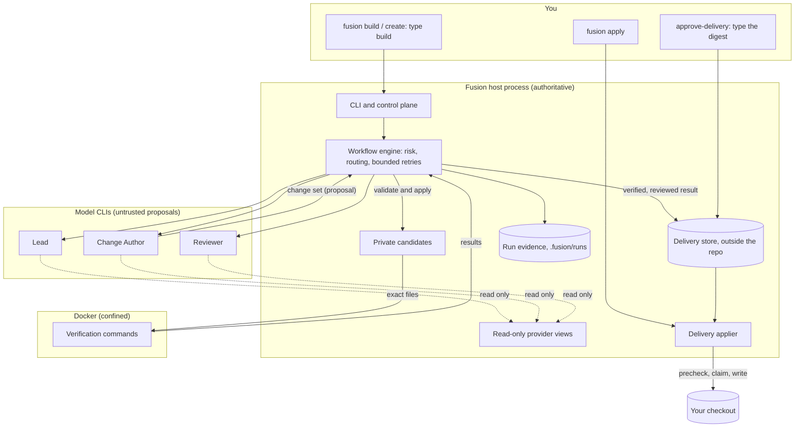

# Architecture overview (v0.6)

Fusion is a local Node.js process that coordinates AI model CLIs on a Git repository. The design rule is simple: **models
reason and propose; Fusion decides, applies, verifies, records and delivers; the human approves.** Everything below follows
from where that line is drawn.

## Components

| Layer | What it does | Where |
| --- | --- | --- |
| CLI and control plane | Parses arguments, discovers the repository and configuration, asks the human, renders redacted output, maps outcomes to stable exit codes | `src/cli`, `src/app` |
| Core policy and workflow | Task inspection and risk (monotonic), capability routing, the workflow state machine, bounded retries, review contracts, adjudication, the change-set contract, delivery manifests | `src/core` |
| Provider adapters | One adapter per model CLI: launch posture, billing/auth lane checks, structured output parsing, provenance | `src/providers` |
| Platform services | Process supervision, provider views, private candidates, confined verification (Docker), delivery store and applier, run evidence | `src/platform` |

The core is provider-neutral: no workflow, policy or command code names a provider or model (guard tests enforce this).
Which CLI and model plays which role is configuration.

## Roles and bindings

| Role | Job | Current validated default |
| --- | --- | --- |
| Lead | Plans the task, proposes the file scope, adjudicates review findings, holds conversations | Claude Code CLI (`opus`) |
| Change Author (`Worker`) | Proposes a change set for the confirmed files | Claude Code CLI (`haiku`) |
| Reviewer | Reviews the verified candidate fresh | Muse CLI (`muse-spark-1.3`) |
| Explorer | Read-only investigation of one bounded area (exploration) | Muse CLI — on the current Muse runtime its posture is not proven, so the validated Reviewer binding explores in separate contexts |

These defaults are the bindings the v0.1, v0.2 and v0.3 live validations ran with; they are not architectural requirements.
`fusion config` shows the bindings in effect.

## The conversational shell (v0.2)

`fusion` without a command reads one line at a time. The host classifies each line deterministically (`core/intent.ts`)
into an intent with a fixed grant: talking, explaining, planning and analysing run read-only conversation turns in a
Fusion-owned view (`app/conversation.ts`), with the primary proven unchanged around every turn; only a change request may
enter the Writer route below, after the human confirms its plan. A broad analysis of a large project is explored as a
team (`app/exploration.ts`): the lead's strictly parsed area plan, isolated explorer turns that see only their packet, the
lead's synthesis and a fresh critique of that synthesis only, followed by a coverage account. Every provider view — of a
conversation or of a build — passes the sensitive-input policy (`platform/workspace/sensitive-input.ts`). The session keeps
bounded findings in memory and only safe metadata on disk.

## Adaptive orchestration (v0.3)

A read-only task no longer follows one fixed pipeline. The host classifies the line (single, team, or the verification
of one finding). The adaptive route (`core/orchestration/route.ts`) then decides every next step from what Fusion
observed, within a host-enforced budget: answer, decide, investigate, synthesize, review.

- The lead **proposes** the next step as one strict JSON routing decision. The route **authorizes** it against the
  actions, areas and investigation count allowed at that moment, or refuses it with a category and falls back to Fusion's
  own bounded choice.
- Investigations run **in parallel** (at most three), each in its own view copy (`ProviderViewStore.replica`) and a fresh
  session, with only its packet. Every one has settled and been cleaned up before the batch returns.
- The host judges the evidence (failed, inconclusive, conflicting, uncited). Transient failures are repeated once. The
  lead may ask for one more batch when the budget allows, reclaims the task with the validated reports, and a fresh
  reviewer critiques the synthesis.
- The session keeps finding identity (`app/session.ts`): the answer's own `Findings:` list; one finding selected by
  position, pronoun or its distinctive terms (several matches, or none, are asked about); and the host-checked evidence
  of its verification, which "fix it" carries into the change task.
- A change request still enters only the Writer route below.

Details: [v0.3 adaptive orchestration](v0.3-adaptive-orchestration.md).

## The reliability engine (v0.4)

Models propose; Fusion observes and decides what its evidence supports; humans approve. `core/evidence/` holds a
host-owned evidence graph (claims; evidence with a source and an authority; a status rule where deterministic evidence
decides and models are only counted), typed proof obligations and the reliability policy (task class and sensitivity →
reproduction, falsification, strictness).

- **Build route:** Fusion's confined checks run on the unchanged baseline first (a reproduction); after the run the
  obligations are evaluated from host facts, and the decision (VERIFIED / UNVERIFIED / BLOCKED) is recorded in the run
  evidence before a delivery exists — a delivery is prepared only when it permits one.
- **Claim checks** (`app/orchestration/claim-check.ts`): one immutable snapshot, two isolated hypotheses in parallel, checks
  Fusion runs itself on the shared (masked) copy, a fresh falsifier, then the lead's diagnosis. Status comes from Fusion's
  checks only.
- **Handoff:** "fix it" on a checked finding carries a validated handoff whose evidence goes STALE if its files changed.

Details: [v0.4 reliability engine](v0.4-reliability-engine.md).

## Candidate tournaments (v0.5)

A Writer build with something to compare can run 2–3 independent candidates (`app/tournament/`, `core/tournament/`).

- **Routing and budget.** The route is decided from host facts before any model turn and bounded by the repository's
  budget. Your confirmation binds the candidate count.
- **Candidates.** Each candidate is a run of the unchanged v0.4 engine in its own private candidate. Fusion freezes one
  verification profile before any exists, runs its own experiments in confinement, selects by host-observed evidence (or
  records a convergence, or reports a tie), and revalidates the selected change freshly.
- **Delivery and records.** Only that change reaches the unchanged delivery. Every tournament event is bound to its
  tournament, candidate and revision.

Details: [v0.5 evidence-driven candidate selection](v0.5-autonomous-engineering.md).

## The Writer route

1. **Plan and confirmation.** The CLI shows the plan: risk, roles, confined verification and the exact files the build may
   write (given with `--path`, or proposed by the Lead in one read-only turn and checked strictly). Before that turn,
   Fusion checks it can verify at all. Nothing runs until the human types `build`; the run authorization is bound to that
   task, that file scope and that repository, and is used once.
2. **Read-only provider views.** Every model session runs in a Fusion-owned, `.git`-free copy (baseline, candidate or
   working tree). The primary checkout is fingerprinted before and after each turn; a view must stay equal to its identity.
3. **Host-owned mutation.** The Change Author's reply is a proposal. Fusion validates it as a canonical change set (bounded,
   canonical paths inside the confirmed scope, preconditions by SHA-256; no shell, Git or rename operations) and applies it
   to a fresh private candidate. See [host-controlled changes](host-controlled-changes.md).
4. **Confined verification.** The candidate's files are streamed into a Docker container built from a pinned image: no host
   mounts, no network, all capabilities dropped, an unprivileged user, a read-only root filesystem. Only Fusion's
   configured read-only commands run. A failure allows one retry with a fresh candidate.
5. **Fresh review and adjudication.** A Reviewer reads a copy of the verified candidate and returns structured findings;
   it never sees the Change Author's transcript or reasoning. The Lead adjudicates each finding; confirmed ones get at most
   one correction, re-verified and re-reviewed. Anything beyond the bounds stops the run for a human decision.
6. **Delivery.** A completed, verified, review-clean result becomes a delivery: a canonical manifest and a bundle of the
   exact validated bytes, written once to the delivery store outside the repository and bound to the repository identity,
   the checkout and the baseline commit.
7. **Approval and apply.** The human inspects the diff and approves by typing the full manifest digest. `fusion apply`
   re-validates everything, prechecks the checkout without writing, takes a single-use claim, writes the files with a
   journaled rollback, and postchecks. It never commits.

A decision a role requests (for example the Lead asking which behavior is wanted) stops the run before any change; its
questions are kept as a bounded, structured request and shown by the CLI.

## State and evidence

| Store | Location | Contents |
| --- | --- | --- |
| Run evidence | `<repository>/.fusion/runs/<run-id>` (self-ignored) | Events, bounded redacted artifacts: outcome, the human's task (redacted), risk, transitions, review counts, model-turn provenance, a decision request if any. Never transcripts, hidden reasoning or credentials. |
| Delivery store | `%LOCALAPPDATA%\Fusion\deliveries` (or `$XDG_STATE_HOME/fusion/deliveries`), one namespace per repository identity | Manifest, bundle, record, approval, append-only lifecycle events, attempt lock, single-use claim. Revalidated on every read; a base overlapping the repository is refused. |
| Durable run state (v0.6) | `<repository>/.fusion/durable/<run-id>` (self-ignored) | The hash-chained, fsync'd run journal and its single-writer lease; persisted tournament candidate results |
| Conversations | In memory only | Bounded chat history for the running session; never written to disk. |

`fusion history` and `fusion show` read these stores and name the next human step. They never resume a run, replay a
model turn or reuse a spent approval. The one recovery is `fusion apply <id>` completing an apply that died while
writing,
exactly once (see the [security model](security-model.md)). In v0.6 the Windows sandbox and the Hyper-V worker are
proven isolation building blocks, not the provider execution path; see
[v0.6 hard isolation and resilience](v0.6-hard-isolation-resilience.md).

## Trust boundaries

| Boundary | Enforced by |
| --- | --- |
| Model → repository | Models never write: read-only launch posture in Fusion-owned views; the primary is fingerprinted around every turn |
| Model output → Fusion | Strict structured parsing and validation; malformed output fails closed; model text is data, not instructions |
| Change → verification | Only the host-applied candidate's files enter a confined container; nothing from the host is mounted |
| Change author → reviewer | Fresh session; review evidence only, never the author's transcript |
| Fusion → your checkout | A delivery only, after your typed approval, a passing precheck and a single-use claim |
| Fusion → the outside | No push, merge, tag, release or publish; verification commands run without network |

## Failure philosophy

Fusion reports explicit states instead of generic failure — blocked, decision required, human gate required, review
required, verification failed, workspace conflict, timeout, cancelled — each with a stable exit code. Unknown capability
state, unverifiable builds and malformed output stop before anything changes.

## What is not included

Unattended (autonomous) Writer mode — applying changes without the human's approval of a delivery — is not enabled.
Its readiness gate (`REAL_WRITER_MODE_READINESS`) and live authorization (`REAL_WRITER_LIVE_GATE_AUTHORIZED`) stay closed;
see [security model](security-model.md#what-remains-out-of-scope).
