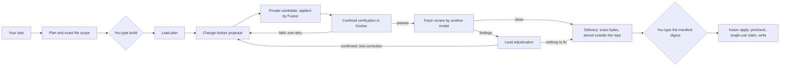

# Fusion CLI — user guide

The operational detail behind the [README](../README.md): the conversational shell, how sensitive files are handled, how a
task is routed, what "analyzed" means, the single-candidate build route, the supported scope, provider updates, apply
recovery, the optional Windows sandbox, every command, troubleshooting and exit codes. For durable runs and isolation
(v0.6) see [v0.6 hard isolation and resilience](v0.6-hard-isolation-resilience.md); for candidate tournaments (v0.5) see
[v0.5 evidence-driven candidate selection](v0.5-autonomous-engineering.md); for the evidence engine (v0.4) see
[v0.4 reliability engine](v0.4-reliability-engine.md).

## Just talk to it

```powershell
cd my-project
fusion
```

```text
Fusion · C:\homeassistant
Folder, not a Git repository · Home Assistant configuration · 13 files · 4 sensitive files kept private
Claude + Muse available
Read-only: this folder has no Git baseline, so Fusion will analyze it but not change it.
> Analyze this Home Assistant configuration
> Explain the first problem
> What would you change?
> Fix it
I can analyze this folder, but I won't change it yet because it has no Git safety baseline. Your files have not been modified.
```

Type what you want in plain words, in English or German: *analyze this project*, *are there problems in the automations?*,
*explain the first finding*, *what would you change?*, *fix the first one*, *history*, *help*. `exit`, `quit` or Ctrl+C
leave; Ctrl+C during a step cancels only that step.

- **Fusion decides what a line may do, not the model.** Each line is classified by Fusion itself (no model involved):
  talking, explaining, planning and analysing are read-only turns; only a change request can lead to a change, and only
  through the verified route below after you say yes. A read-only turn can never turn into a write.
- **Teamwork where it pays off.** A small question gets one model. A broad analysis of a large project, or the question
  whether a finding really holds, becomes an adaptive route. The Lead (Claude by default) decides whether to answer or to
  delegate bounded investigations. Explorers (Muse) run them in parallel, each in its own copy. The Lead reclaims the task
  with their reports, and the Reviewer (Muse) gives a fresh second opinion. Fusion's host policy authorizes every step and
  caps it with a budget (see [below](#how-fusion-routes-a-task-v03)).
- **Changing things in a Git repository:** *fix the first one* shows the build plan (task, exact files, verification) and
  asks `Start this verified build? [y/N]`. If the build prepares a delivery, you get one summary — files, verification
  result, review result, delivery id and manifest digest — and `Apply these exact verified changes? [y/N]`. Nothing is
  committed or pushed.
- **Refused:** requests to skip the safety steps (*just edit it directly without all that safety stuff*). Unbounded
  destructive requests (*delete everything*) are asked back.

### Folders without Git

Fusion analyzes any folder — a Home Assistant configuration, a scripts folder — read-only. It **never changes a folder
that is not a Git repository**: without a baseline it could neither prove what it changed nor give you a clean way back.
To let Fusion prepare changes, create the baseline yourself (back up the folder, add a `.gitignore` for `secrets.yaml`,
`.storage/` and other private files, then `git init`, `git add -A`, `git commit`). Fusion never creates, overwrites or
pushes a repository for you.

### Sensitive files

Before any model can read a project, Fusion copies it into a private, read-only view and applies its input policy:

- **Withheld** (never copied): private keys and certificates (`*.pem`, `*.key`, `id_rsa`, …), credential files
  (`credentials*`, `.git-credentials`, `.npmrc`, `.netrc`, service-account and token files, `secrets.json`), authentication
  stores such as Home Assistant's `.storage/`, `.ssh/`, `.aws/`, databases, binaries and files over 1 MiB.
- **Key names only**: `secrets.yaml` / `secret*.yml` and `.env` / `.env.*` — a model sees which secrets exist
  (`mqtt_password: <redacted>`), never their values.
- **Masked values** in every other text file: tokens and API keys, JWTs, bearer tokens, passwords in URLs, private-key
  blocks, and secret-named settings (`password: …` in configuration files).

**The same policy covers building.** When a conversation turns into a change ("fix it"), the Lead, the Change Author
and the Reviewer read the same filtered copies, and every review diff masks secret values. Two rules keep changes exact:

- A **protected file** (anything withheld or reduced to key names above) is never part of a build: if a fix would have to
  change one, Fusion stops before any model turn and tells you why — make that change yourself, or narrow the task.
- A **normal file with a secret value inside** (an inline password in `configuration.yaml`) stays editable. The Change
  Author sees `password: <redacted:password:1>` and keeps that marker; Fusion puts the exact value back on its own side
  before applying, verifying and delivering. A marker Fusion cannot restore exactly stops the build for your decision.

The delivery then holds the exact bytes to write (it has to, to apply them); it stays in your local application state and
never goes to a model.

The inventory reports which files were kept private; their contents are never read into a prompt. The shell remembers only
safe metadata per project (counts, the last delivery id) in Fusion's application-state directory — never a transcript,
finding or secret.

### How Fusion routes a task (v0.3)

Fusion does not pick one fixed pipeline when you ask something. It classifies your line itself (no model involved), then
decides each next step from what it observed:

- **A simple task stays simple.** *what does package.json do?*, *explain the first finding* or a narrow analysis is
  one lead turn: `Route: lead only`.
- **A large task is delegated.** *analyze the whole repository* on a large project starts with the Lead's routing
  decision: answer directly, or delegate up to three bounded investigations. Each investigation runs **in parallel**, in
  its own read-only copy of your project and a fresh provider session, with only its packet (area, question, earlier
  validated findings), never a transcript. The Lead then reclaims the task with the validated reports.
- **Weak evidence escalates, within budget.** Failed, inconclusive, conflicting or uncited reports are weak evidence. A
  transient failure is repeated once, and every failed attempt is shown with its category. The Lead may ask for one more
  bounded batch, synthesize with what is known, or stop without a conclusion. A single answer that runs out of steps
  escalates to delegation.
- **Is it really a bug?** *is the first finding really a problem?* or *is the trusted_proxies finding really a problem?*
  checks that one finding as a claim.
  - Fusion selects the finding by position or by its distinctive terms. If several findings match, or none, it asks
    rather than guessing.
  - The Lead answers directly, or investigations judge the claim (supported, contradicted, unclear). A disagreement is
    shown as a conflict, never merged into a fake consensus.
  - *fix it* then takes that finding, with the files its verification cited, into the same verified build route as
    before, and never the analysis's broad proposal.

Every analysis says what happened, without any model's reasoning:

```text
  Route: lead decision → 3 parallel investigations → lead synthesis → fresh review
  Turns: 6 model turns (lead 2 · explorers 3 · reviewer 1) · 1 batch (1 parallel) · 41 s
```

**A model only proposes the next step; Fusion authorizes it.** A routing decision is one strict JSON object, read against
the actions, areas and budget Fusion allows at that moment. A request for an unknown or withheld area (such as Home
Assistant's `.storage/`), for too many investigations, or with any extra field is refused, and Fusion falls back to its
own bounded choice and says so. Host-enforced budgets cap concurrent investigations, batches, repeats and model turns
per role and in total, and time. When a budget runs out, the route stops and says the evidence is incomplete. No model
can raise its own budget, widen a view or start a change.

`history` in the shell also shows safe counts of this session's routes (turns per role, parallel batches, repeats,
escalations, budget stops). Nothing of a prompt or reply is stored.

### How Fusion decides what holds (v0.4)

A model's claim is never evidence on its own. Fusion keeps an evidence graph: what a model claimed, what Fusion itself
observed, and whether that supports or contradicts the claim.

- **"is it true that …?", "is that really a bug?", "why does … fail?"** start a claim check:
  - one evidence snapshot goes to two independent investigators, each in its own copy and session;
  - Fusion runs the exact-text checks they propose (or derives from your claim) on the shared copy itself;
  - a fresh falsifier tries to break the conclusion.

  The claim is SUPPORTED or CONTRADICTED only by Fusion's checks, and stays UNVERIFIED otherwise, however many models
  agree.
- **A build proves its proof obligations** — Fusion's checks on the unchanged baseline first (fail before, pass after),
  scope, protected files and, where the policy requires it, a fresh falsification. `Decision: VERIFIED` is the only
  decision a delivery is prepared for without a question. An UNVERIFIED or BLOCKED run is never delivered as a success.

Details: [v0.4 reliability engine](v0.4-reliability-engine.md).

### What "analyzed" means (coverage)

After each analysis Fusion prints what it can vouch for: how many files it inventoried (and which folders it skipped),
how many it shared with the models as-is, masked or withheld, which areas it assigned to explorer investigations (and
whether each report came back), which shared files the final answer cites, and which areas were neither assigned nor
cited. A broad analysis also says who chose the areas: `Planning: Claude selected 2 investigation areas (…)`, or — when
the lead's structured plan is invalid or its planning turn fails — `Planning: Claude's structured plan was invalid
(unknown area); Fusion selected 3 bounded areas instead (…)`. Fusion cannot see which files a model actually opened, so
"assigned" and "cited" are all it claims; it never says the whole project was read.

## Examples

```powershell
# Talk about the repository you are in (REPL; /help lists commands) — or ask once
fusion chat
fusion chat -- "Where is authentication handled?"

# Inventory plus one model analysis; --inventory-only runs no model at all
fusion analyze --focus tests

# Build: Fusion shows the plan and the exact files, and starts only when you type "build"
fusion build -- "Fix the rounding in src/price.ts and add a regression test."
fusion build --path src/price.ts --path test/price.test.ts -- "Fix the rounding and add a regression test."
fusion build --candidates 2 --path src/price.ts -- "Fix the rounding."   # ask for 2 independent candidates yourself

# Deliver the result: read the diff, approve by typing the manifest digest, apply
fusion inspect-delivery d-0123456789abcdef01234567
fusion approve-delivery d-0123456789abcdef01234567
fusion apply d-0123456789abcdef01234567

# Start a new project: a template and a Git baseline in a new directory, then the confirmed build
fusion create --template cli --name renamer -- "a command-line tool that renames photos by their date"

# What happened, and what to do next
fusion history
```

A repository needs a confined verification plan in `fusion.config.json` before it can be built (projects made by
`fusion create` get one):

<details>
<summary>Example <code>fusion.config.json</code></summary>

```json
{
  "schemaVersion": 1,
  "verification": {
    "commands": [],
    "platformRequirement": "linux-compatible",
    "dependencies": "none",
    "confinedCommands": [
      { "id": "unit", "executable": "/usr/local/bin/node", "args": ["--test", "test/**/*.test.ts"], "cwd": ".",
        "timeoutMs": 180000, "mutationPolicy": "readOnly" }
    ],
    "experiments": {
      "probes": [
        { "id": "cli-help", "expect": "baseline",
          "command": { "executable": "/usr/local/bin/node", "args": ["bin/cli.js", "--help"], "cwd": ".",
            "timeoutMs": 30000, "mutationPolicy": "readOnly" } }
      ],
      "mutation": { "maxPerCandidate": 2 }
    }
  },
  "limits": { "runTimeoutMs": 1800000, "maxCandidates": 2 }
}
```

With a configuration file, its `bindings` replace the built-in role defaults — copy them from a project `fusion create`
made, or omit the file to use the defaults for `chat` and `analyze`. `conversation.partner` sets the default chat partner.
The file must never hold secrets; credential-like keys are refused.
</details>

## How a single-candidate build works

This is the route of every build with one candidate (a simple task, `--candidates 1`, or `limits.maxCandidates: 1`). A
candidate tournament runs this route once per candidate, then selects and revalidates; see
[v0.5 evidence-driven candidate selection](v0.5-autonomous-engineering.md).



- Every model session runs **read-only** in a Fusion-owned copy of the repository; the Change Author's output is a
  proposal (a validated change set), never a write.
- A run has at most one verification retry and one review-driven correction; beyond that it stops for your decision.
  If the Lead needs a decision, the run stops before any change and shows its questions.
- The roles are configuration. The current, live-validated defaults bind the **Lead** and the **Change Author** to the
  Claude Code CLI and the **Reviewer** to the Muse CLI; `fusion config` shows what is in effect.

More: [architecture overview](architecture-overview.md).

## Supported scope

| Area | v0.6 |
| --- | --- |
| Host | Windows 11 (validated). Other hosts are untested. |
| Runtime | Node.js ≥ 22, Git, npm |
| Providers (defaults) | Claude Code CLI (Lead, Change Author) and Muse CLI (Reviewer, Explorer), each logged in with a subscription; API-key and gateway credential sources are refused. Bindings are configurable per role. Claude Code: 2.1.280 is the recorded validated release; later 2.1.x patches are accepted after Fusion checks their read-only posture itself (see [Claude updates](#claude-updates)); other release lines are refused until Fusion supports them. Muse: the Reviewer binding is validated on exact releases and binaries (1.4.0-R4161.1 and 1.4.0-R4302.1, each by its SHA-256); any other release or binary is refused until validated. The dedicated Explorer binding is not validated, so the validated Reviewer binding runs investigations. |
| Verifier | Docker with Linux containers and the pinned `node:22.20.0-bookworm-slim` image (by digest) |
| Verification platforms | `linux-compatible`, `platform-neutral`; `windows-required` is refused before any model turn |
| Dependencies | `none`, or `npm-lockfile`: a restricted npm lane (registry-only, integrity-checked packages from the lockfile, no lifecycle scripts, installed in a separate preparation container). A change to a dependency manifest stops for a human decision. |
| Change size | The exact files confirmed before the run (the Lead proposes at most 24); a change set has at most 32 operations, 1 MiB per file, 4 MiB in total |
| `create` | Node.js 22.18+ with TypeScript (type stripping) and `node:test`; families `library`, `cli`, `api`; no dependencies. Other stacks are refused. |
| Runs | One verification retry and one review-driven correction per run (per candidate in a tournament) |
| Candidates | 1–3 per build: 2 by default for a change with something to compare, otherwise 1; `--candidates` and `limits.maxCandidates` set or cap it. At most 2 run at once. |
| Experiments | `verification.experiments`: at most 4 probes, 2 property runs (≤ 200 cases), 2 fuzz runs (≤ 500 cases), 3 mutations per candidate |
| Checkouts | Byte-stable for the files a build may touch: a checkout that would transform them (`core.autocrlf`, `eol`/`text` attributes, filters, `working-tree-encoding`) is refused after confirmation, before the build's first model turn (`checkoutByteTransform`). |
| Recovery | An apply interrupted while writing is recovered by running `fusion apply <id>` again; nothing resumes an interrupted build. |
| Sandbox | Optional and from a source checkout only (see [Windows sandbox](#windows-sandbox-optional-source-checkout)); it is not the provider execution path. |

## Claude updates

Claude Code updates itself often. Fusion does not trust a version number: before a new patch of the validated release
line (2.1.x after 2.1.280) serves its first turn, Fusion checks that runtime's read-only posture mechanically — init-only
startups in a Fusion-owned test folder whose project settings, local settings, MCP file, agents, skills, commands and
hooks would show up (or leave a marker file) if Claude's isolation flags did not hold. No model is called and nothing is
sent. Every turn then proves the rest again: exactly Read, Grep and Glob as tools, no MCP server, no plugin, no hook,
`dontAsk`, the configured model and a subscription login with no API key. `fusion doctor --probe` runs the same check on
demand and prints the result. If the check fails, or the runtime belongs to another release line, Fusion refuses in plain
words and sends nothing; a new release line needs a Fusion update. One property is not observable without a model turn:
whether CLAUDE.md reaches the model; on a checked patch it rests on `--safe-mode`, whose other effects the check proves.

## Apply recovery

An apply is a journaled transaction over the delivery's files.

- **Interrupted while writing.** If `fusion apply` dies after its claim and its recorded start (a crash, a closed
  terminal, a power loss), the delivery stays `applying`. Run `fusion apply <id>` again. Fusion re-binds your
  approval, rechecks the checkout and completes that same apply exactly once. It never writes a file twice. If a target
  file was changed by someone else in the meantime, it stops and does not overwrite it.
- **Interrupted earlier.** An apply that died before it started writing stays fail-closed: the delivery is locked, or
  its
  approval is spent. Nothing was written; build again for a new delivery.
- **Two at once.** A second `fusion apply` of the same delivery while one is running is refused: "already claimed by
  another writer; nothing was changed". The lease of a process that died is taken over safely.

## Windows sandbox (optional, source checkout)

v0.6 adds an AppContainer sandbox for future hard isolation of untrusted processes. Today it is groundwork:

- builds, reviews and conversations do **not** run providers in it;
- no real provider turn has run inside it yet.

Its native launcher is **not** part of the packed CLI, so an installed `fusion` reports the launcher NOT built and the
posture UNAVAILABLE. To try it from
a source checkout:

```powershell
powershell -File native/fusion-sandbox/build.ps1   # the in-box .NET Framework compiler; no SDK, no network
npm run build
node dist/src/cli/main.js sandbox doctor
```

`fusion sandbox doctor` runs confinement canaries and reports each property only as far as a canary proved it, for the
identity it names (`--identity`, default `fusion.sandbox.default`).

- **Network.** Deny-all is HARD only for an identity without a loopback exemption.
- **Loopback exemption.** `fusion sandbox install` shows the single elevated command that adds a package-scoped
  loopback exemption, which a host-side broker needs. Fusion never elevates itself, and `uninstall` removes the
  exemption.
- **What an exemption costs.** An exempted identity can reach **any** service on 127.0.0.1, so doctor reports it at most
  CONFINED, with broker-only loopback NOT PROVEN.

## Expert commands

Everything the shell does is also available as a command, for scripts and for full control:

| Command | Purpose |
| --- | --- |
| `fusion` | The conversational shell (interactive terminal only; otherwise exit 2) |
| `fusion chat [--with <partner>] [-- "<message>"]` | Read-only conversation (REPL, or one message); works in folders without Git |
| `fusion analyze [<path>] [--deep] [--focus <topic>] [--inventory-only] [--with <partner>]` | Inventory plus one read-only model analysis; works in folders without Git |
| `fusion build [--path <p>]... [--operation <op>] [--timeout <s>] [--candidates <1-3>] [--] "<task>"` | Confirmed, verified, reviewed build (one candidate or a tournament) that prepares a delivery |
| `fusion create [--template library\|cli\|api] [--name <dir>] [--] "<description>"` | New project, then the confirmed build |
| `fusion inspect-delivery <id>` | Digests, target, diff, evidence, approval state |
| `fusion approve-delivery <id>` | Approve by typing the manifest digest (interactive only) |
| `fusion apply <id>` | Precheck, single-use claim, write; rollback on failure; recovers an apply interrupted while writing |
| `fusion history [--limit <n>]` | Recent runs, their deliveries, the next step |
| `fusion show <run-id>` | One run: outcome, model turns, delivery, next step |
| `fusion config` | Effective roles, models, verifier profile, state locations |
| `fusion doctor [--probe]` | Read-only diagnostics |
| `fusion review [--base <ref>] [--no-verify] [--timeout <s>]` | Fresh read-only review of your working tree |
| `fusion audit` | Deterministic audit of Fusion-relevant state |
| `fusion sandbox <doctor|install|uninstall> [--identity <name>] [--allow <host:port>]` | Optional Windows sandbox: proven posture, and the one elevated network-provisioning step (source checkout only; `--allow` is for `install`) |

Global options: `--json` (not for `create` and `approve-delivery`, which ask you), `--debug`, `--config <file>`,
`--cwd <dir>`. `fusion <command> --help` shows one command.

<details>
<summary>Troubleshooting and exit codes</summary>

| Symptom | What to do |
| --- | --- |
| `Build not started: Confined verification is not available …` | Start Docker (Linux containers) and pull the image above; `fusion doctor` shows the verifier. No model turn was spent. |
| `No confined verification plan is configured` | Add `verification.confinedCommands` and `platformRequirement` to `fusion.config.json`; `fusion config` shows the plan. |
| `Not inside a Git working tree` | `build`, `review`, deliveries and history need a Git repository (`fusion`, `chat` and `analyze` also work in a plain folder, read-only). |
| `No configured provider can hold a conversation` | `fusion doctor`: log in to the provider CLIs; check `fusion config`. |
| `The proposed scope …` refused | The Lead proposed a path Fusion does not allow; rerun with `--path` for each file. |
| `DECISION_REQUIRED` | The Lead asked for a decision (the output, `fusion show` and `fusion history` list its questions), or the run reached its bounds. Decide or refine, then build again with that in the task. |
| Apply: precheck failed | Your checkout changed (HEAD moved, files differ, untracked files). Fix it — the approval is kept — and apply again. |
| Apply: `approval was spent` | That delivery was applied, rolled back, or claimed without starting to write; build again for a new delivery. An apply interrupted *while writing* is not spent: run `fusion apply <id>` again to recover it. |
| Apply: `already claimed by another writer` | Another `fusion apply` of that delivery is running; wait for it. Nothing was changed. |
| Build: `checkoutByteTransform` | Your checkout would change the bytes of files the build may touch (for example `core.autocrlf=true`). Use a byte-stable checkout (for example `core.autocrlf=false` and a fresh checkout). Nothing was changed, and the build ran no model turn (only the Lead's read-only scope proposal, if you gave no `--path`). |
| `fusion sandbox doctor`: launcher NOT built, posture UNAVAILABLE | The launcher is not built, or you run an installed package; see [Windows sandbox](#windows-sandbox-optional-source-checkout). |
| `WRITER_NOT_READY` in doctor | It concerns unattended Writer mode, which stays off; confirmed builds do not need it. |

Exit codes: 0 completed/answered/ready, 1 internal, 2 invalid input, 3 billing/auth, 4 security policy, 5 capability
unavailable, 6 provider failure, 7 timeout, 8 workspace conflict (including precheck failures and rollbacks), 9 verification
failed, 10 storage, 11 blocked, 12 review required, 13 decision required, 14 human gate required, 15 degraded (doctor), 130
cancelled.
</details>
